# Winter Bash 2018 Hats

Every known [Stack Exchange Winter Bash 2018](https://winterbash2018.stackexchange.com/) hat preserved in their original SVG format.

## Notes

These hats were made by [Stack Exchange](https://stackexchange.com), and the license for reusing them is unknown.

## Public Hats

### Scarf Ace

[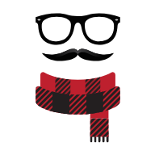](hats/public/scarf-ace.svg)

> Earn the Guru badge

> Earn the Guru badge

### Glasses With A Number On Top

> Starred chat, ±12h from Jan 1, 0:00 UTC

> Post a message in chat within ±12 hours of the UTC New Year’s begin that gets starred

### It Ain’t Easy Being Cheesy

[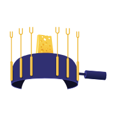](hats/public/it-aint-easy-being-cheesy.svg)

> Wear 6 hats, changing hats here in 6 days

> Wear six different hats in total (anywhere), and change your hat on six different UTC days using the hat rack on this site

### Six-Cornered Hat

> Earn the Necromancer badge

> Earn the Necromancer badge

### Peacekeeper

[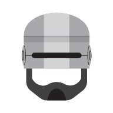](hats/public/peacekeeper.svg)

> 20 reviews, no fails

> Successfully complete 20 reviews without failing an audit

### Rep Hunter

> 5 accepted answers in 1 day

> Post 5 answers that get accepted, all posted in a single UTC day or all accepted in a single UTC day

### Pizza Hat

> Answer +3 a question with accepted answer

> Post a competing answer to an existing accepted answer, reaching a score of at least +3

### Red Baron

[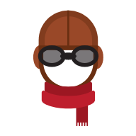](hats/public/red-baron.svg)

> Answer question at -3, becomes +3 and answer +5

> Answer a question scoring -3 or lower; the question eventually becomes 3+ and your answer becomes 5+

### Brunhilde

[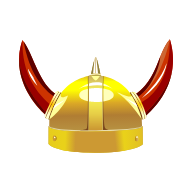](hats/public/brunhilde.svg)

> Earn 150 rep on three non-SO sites in 15 days

> Earn 150 reputation points on three different sites (not including Stack Overflow) within 15 days.

### SO Goes Flapper

[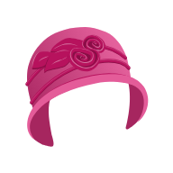](hats/public/so-goes-flapper.svg)

> Short answer accepted over long answer

> Post an answer with fewer than 600 characters that gets accepted while there is a competing answer with more than 600 characters

### Team Player

[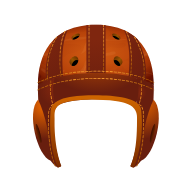](hats/public/team-player.svg)

> Visit stackoverflow.com/teams

> Visit the Stack Overflow for Teams landing page at [stackoverflow.com/teams](https://stackoverflow.com/teams)

### It’s-a me!

> Delete 6 comments after owner edits post

> Delete 6 comments from under posts (not your own) that were edited by their owners after you commented on them

### Still Fresh

[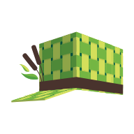](hats/public/still-fresh.svg)

> New user, less than 6 months old, earn 25 rep

> Be a user on the site for less than 6 months before Winter Bash, or join during Winter Bash; have earned at least 25 reputation

### IDENTIFICATION DIVISION

[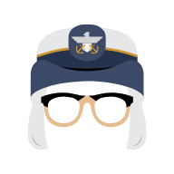](hats/public/identification-division.svg)

> Earn a silver badge

> Earn a silver badge

### Top(bar) Hat

> Earn rep for an answer or get an answer

> Post a question that gets answered or earn reputation with an answer you post

### I’ll Handle It

> Close, edit, reopen a question

> Vote to close a question, edit it from closed, vote to reopen

### Freehand Circle

> Earn the Nice Answer badge on meta

> Earn the Nice Answer badge on meta

### Explorer

> Accepted answer with no votes

> Post an accepted answer that receives no other votes for 12 hours

### Gonna Find Out

[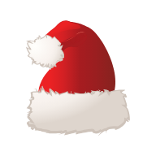](hats/public/gonna-find-out.svg)

> Vote 150 times

> Cast 150 votes on questions or answers

### Member of The Hand

[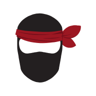](hats/public/member-of-the-hand.svg)

> +3 post as new contributor, meta or main

> Post a question or answer on meta or on the main site that appears with the New Contributor indicator and gets a score of 3

### Silencium

[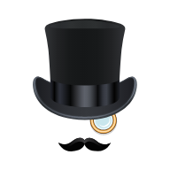](hats/public/silencium.svg)

> Question with no answers for a week

> Ask a question that gets no answers within a week of being posted

## Secret Hats

### Propel Thyself

[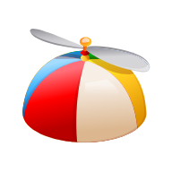](hats/secret/propel-thyself.svg)

> Secret

> This is a secret hat

### James Bond

> Secret

> This is a secret hat

### Clean-Up Duty

[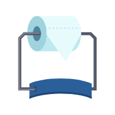](hats/secret/cleanup-duty.svg)

> Secret

> This is a secret hat

### Sun Wukong

[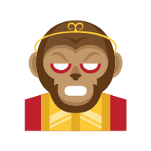](hats/secret/sun-wukong.svg)

> Secret

> This is a secret hat

### The Merlin

[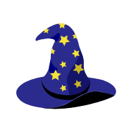](hats/secret/the-merlin.svg)

> Secret

> This is a secret hat

### Retro Fan

[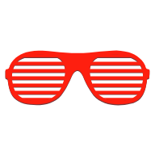](hats/secret/retro-fan.svg)

> Secret

> This is a secret hat

### Rubber Ducky

> Secret

> This is a secret hat

### Waffles

[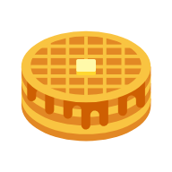](hats/secret/waffles.svg)

> Secret

> This is a secret hat

### Eliza Doolots

[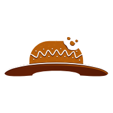](hats/secret/eliza-doolots.svg)

> Secret

> This is a secret hat
